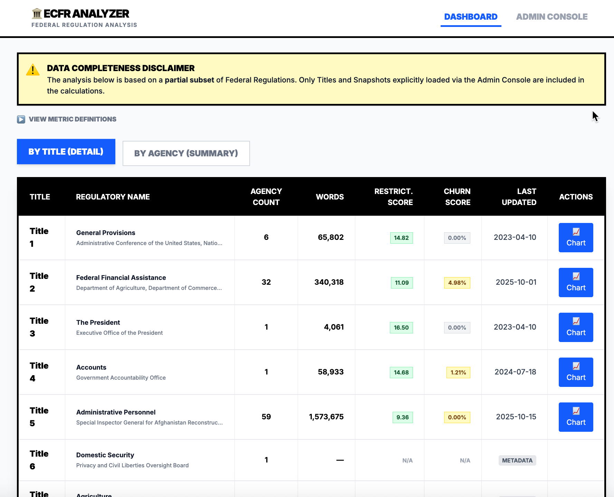
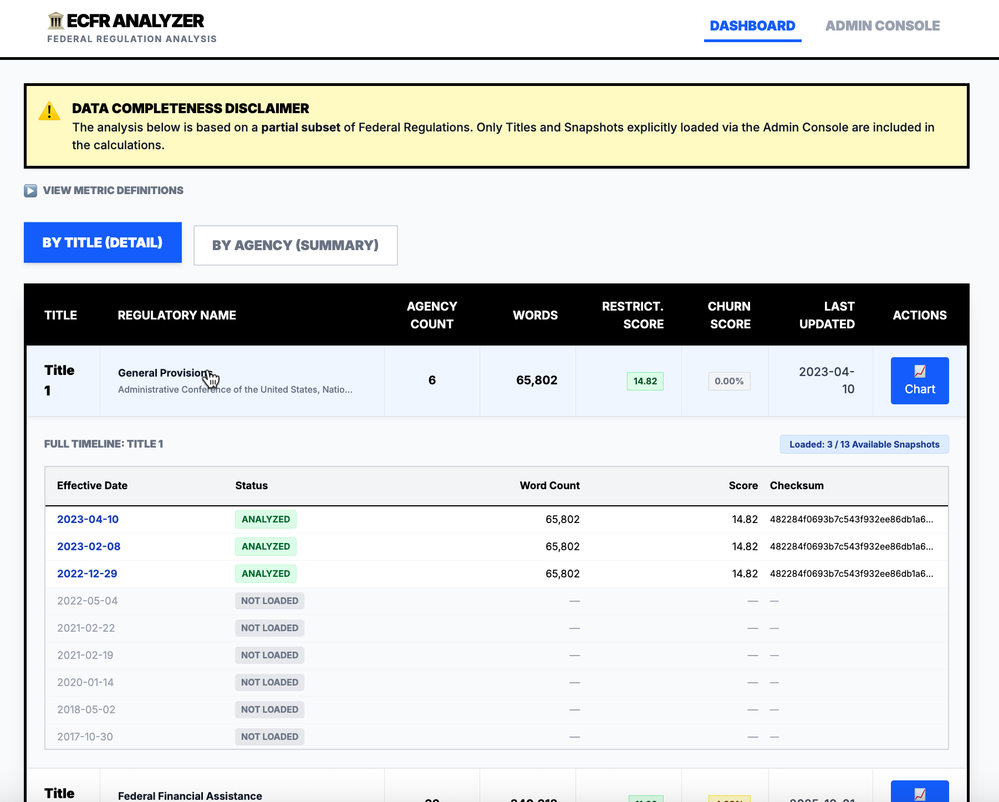
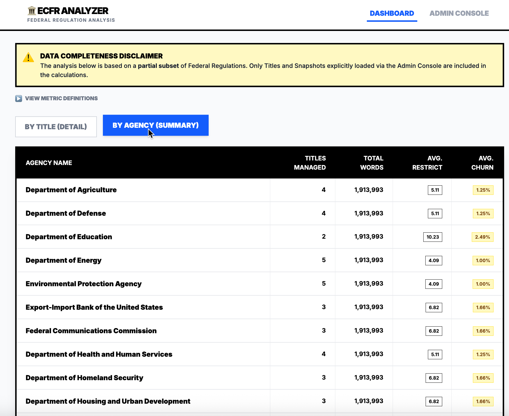
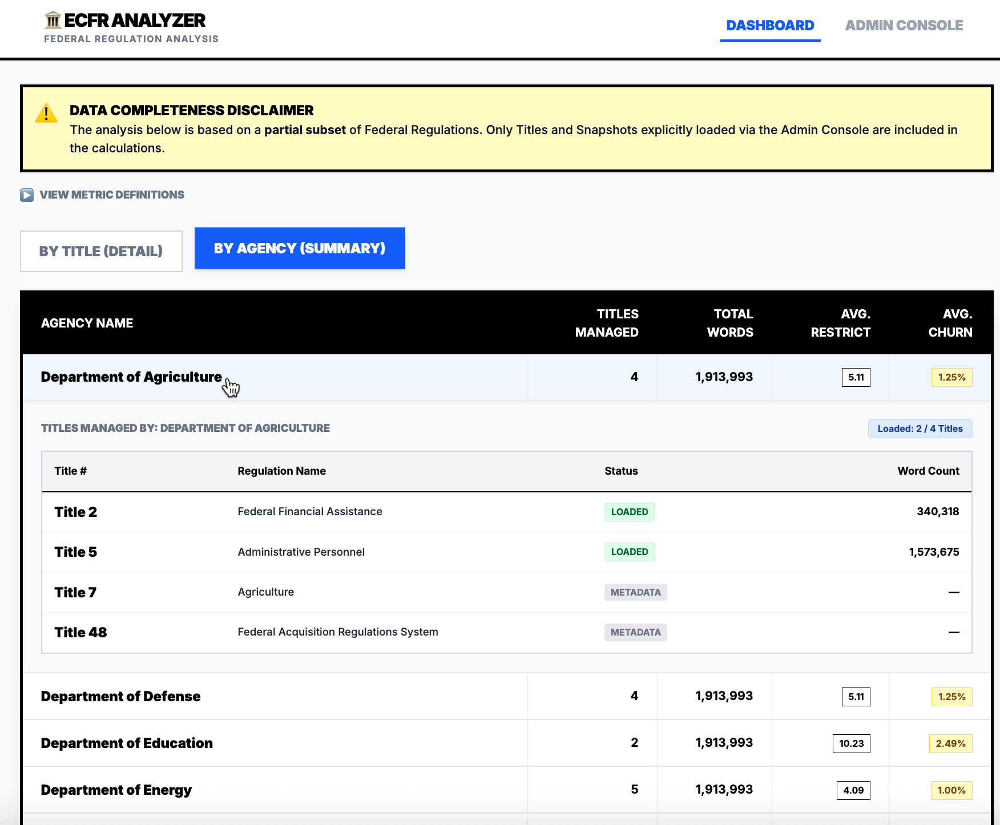
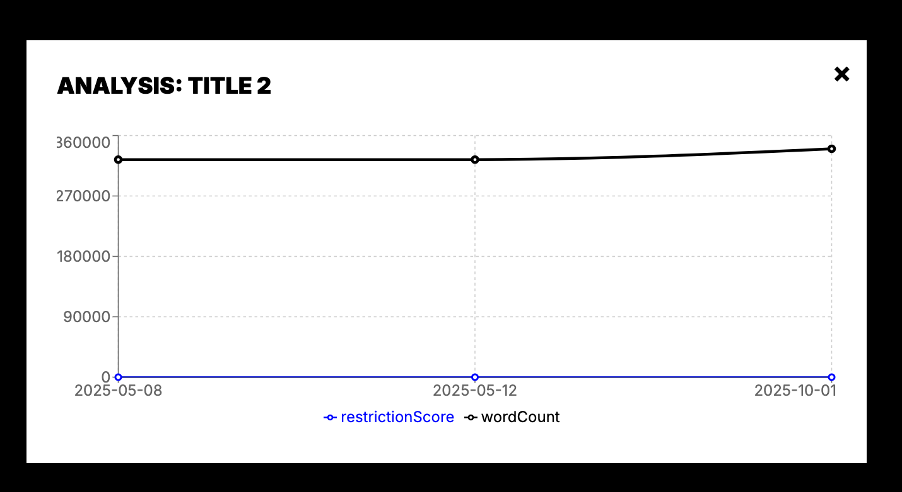
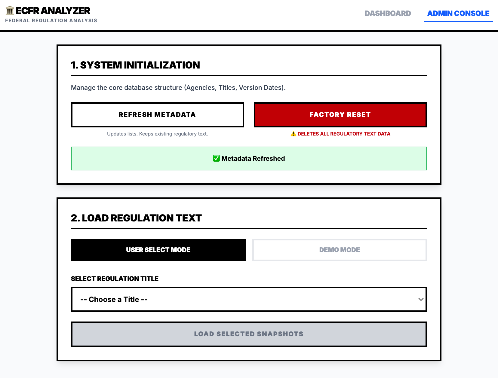
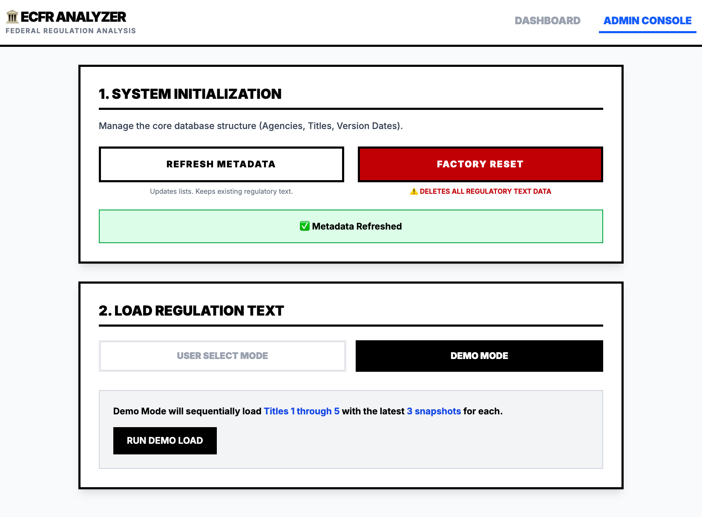
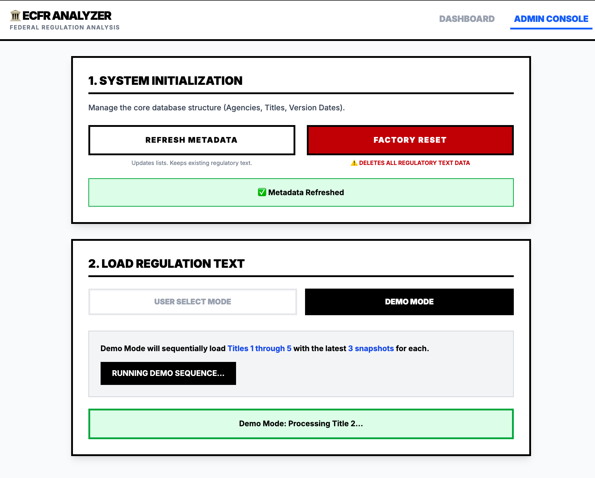
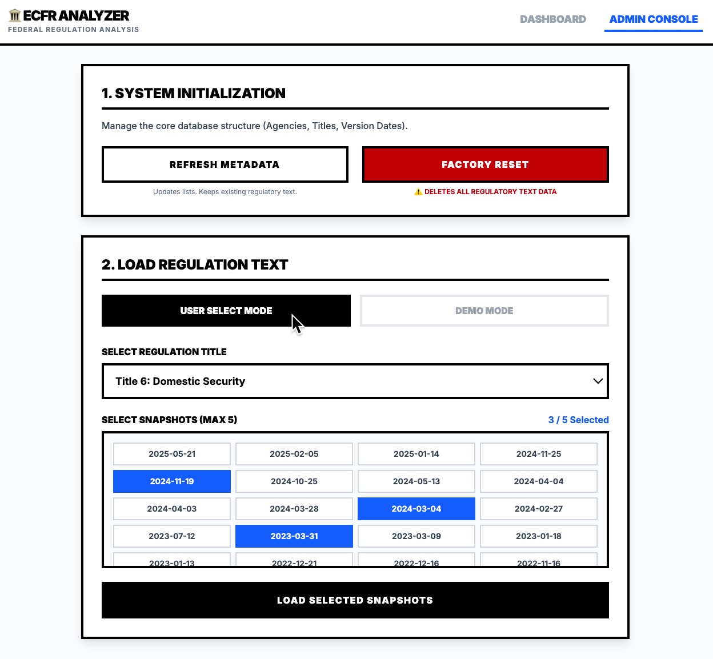
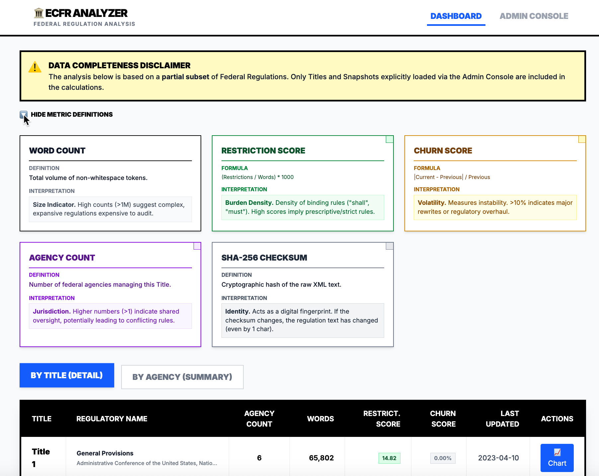

# USDS Engineering Take-Home: eCFR Analyzer

A Next.js application to analyze Federal Regulations, track historical changes, and calculate regulatory burden metrics (Restriction Scores & Churn).

## 🚀 Quick Start (Mac/Linux)

1.  **Install Dependencies:**
    ```bash
    npm install
    ```

2.  **Setup Database:**
    ```bash
    npx prisma generate
    npx prisma migrate dev --name init
    ```

3.  **Run the Server:**
    ```bash
    npm run dev
    ```
    Open [http://localhost:3000](http://localhost:3000).

## ⚙️ How to Load Data (Important)

The database starts empty. You must seed it via the UI:
1.  Navigate to **Admin Console** (Top right button).
2.  **Step 1:** Click **"Initialize Metadata"** (Fetches Agency/Title lists from eCFR).
3.  **Step 2:** Click **"Demo Mode"** -> **"Run Demo Load"**.
    * This automatically downloads Titles 1-5 (3 snapshots each).
    * *Note:* You can also use "User Select Mode" to pick specific titles.

## 📊 Metrics Explained

* **Word Count:** Raw volume of text.
* **Restriction Score:** `(Restrictive Words / Total Words) * 1000`. (Terms: "shall", "must", "prohibited").
* **Churn Score:** Percentage change in word count from the previous snapshot.
* **Checksum:** SHA-256 hash of the raw XML text for version verification.

## 🛠️ Tech Stack
* **Framework:** Next.js 14 (App Router)
* **Language:** TypeScript
* **Database:** SQLite + Prisma
* **Styling:** Tailwind CSS (High Contrast / Brutalist Design)
* **Charts:** Recharts


## UI Screenshots

### Dashboard (Title View)


### Dashboard (Title View with History)


### Dashboard (Agency View)


### Dashboard (Agency View with Titles)


### Historical Chart Analysis


### Admin Console (Select Mode)


### Admin Console (Select Mode)


### Admin Console (Select Mode)


### Admin Console (Select Mode)



### Dashboard Metric Guide (Select Mode)
